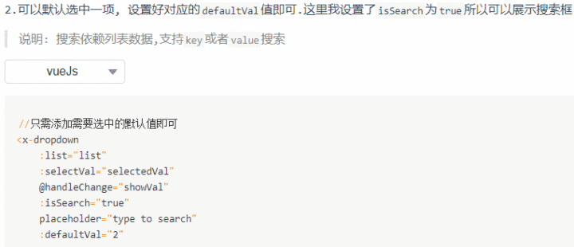
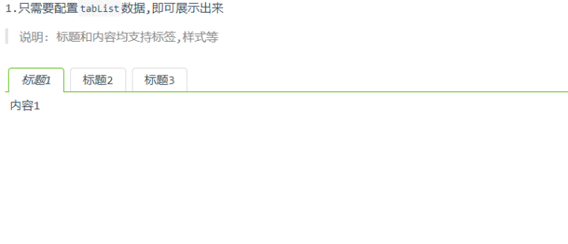
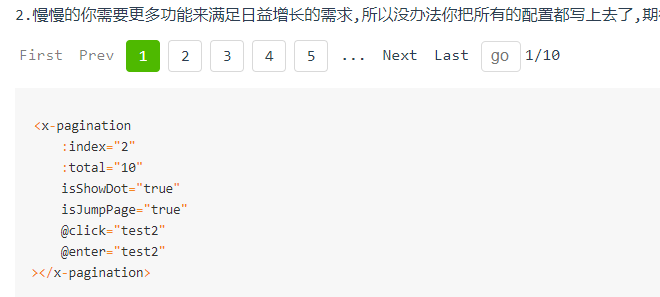
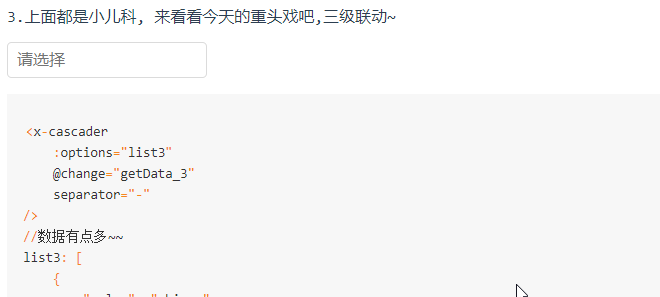
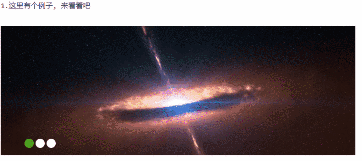

# xui-vue

### 项目名称: [xui-ui](https://github.com/xumengzi/xui-vue)

#### 一个基于 `vueJs2.0`,可以提供丰富的方法, 组件, 插件的项目.

1. 简介: 一个基于vuejs2.0,可以提供丰富的方法,组件,插件的组件库.

2. 依赖: vuejs2.0

3. 兼容性: IE9及以上高级浏览器

```javascript
使用方法如下
1. npm install xui-ui

2. 按需引入各个组件
import Vue from 'vue';

// 导入插件
import {
  XuiCalender,
  XuiSlider,
  XuiCascader,
  XuiDigital,
  XuiTab,
  XuiDropdown,
  XuiPagination,
  XuiLoading,
  XuiMessage,
  XuiModal,
  XuiNotification
} from 'xui-ui';

Vue.use(XuiCalender);
Vue.use(XuiSlider);
Vue.use(XuiCascader);
Vue.use(XuiDigital);
Vue.use(XuiTab);
Vue.use(XuiDropdown);
Vue.use(XuiPagination);
Vue.use(XuiLoading);
Vue.use(XuiMessage);  // 2种方式调用loading组件, loading的名字为$loading
Vue.use(XuiModal);
Vue.use(XuiNotification)

// 2种方式调用loading组件, loading的名字为$showLoading, 可以自定义
Vue.prototype.$showLoading = XuiLoading.LoadingService  
```

#### 下面是一些例子 

1. message 信息提示


2. notification


3. loading


4. modal


5. dropdown



6. tab



7. pagination



8. cascader



9. slider




#### 文件目录

packages-mobile ->  移动端组件库
xui-m-ui ->  编译后的移动端组件库

packages-pc -> pc端组件库
xui-ui -> 编译后pc端组件库

book -> build后的文件夹
src -> 文档说明
imgs -> 演示图片


有问题的组件

rate
pagination
slider